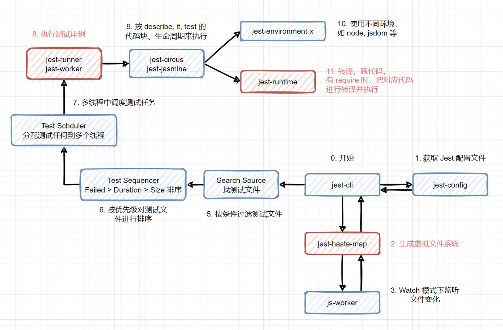

JEST DOC https://jestjs.io/docs/getting-started

项目原地址：https://github.yanhaixiang.com/jest-tutorial/
省略： Redux 测试、React Hook 测试

Jest 性能优化
1、虚拟文件系统 jest-haste-map
2、多线程 maxWorkers jest --runInBand
3、文件转义 npm i -D @swc/core @swc/jest // 使用 swc 转译 JavaScript 和 TypeScrit "^.+\\.(t|j)sx?$": ["@swc/jest"],

测试： E2E\集成\单测

规范工具：eslint\prettier\typescript
